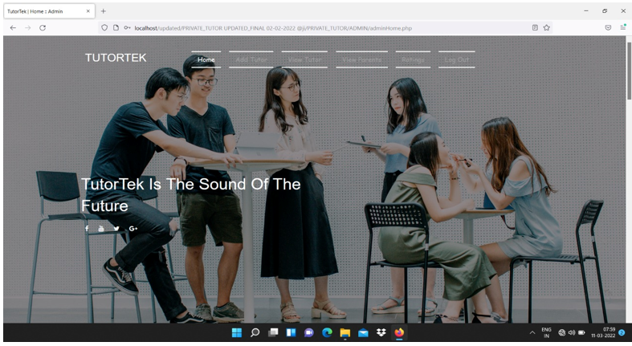
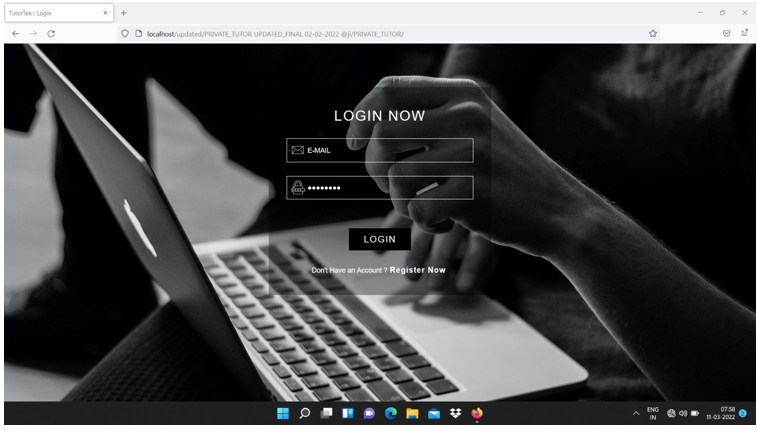
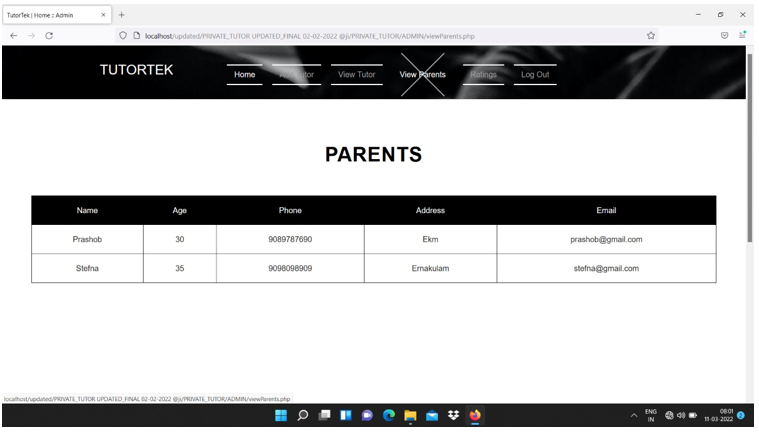
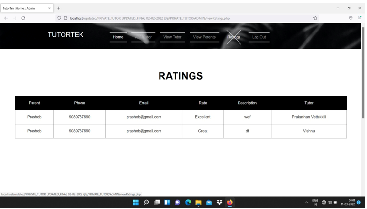
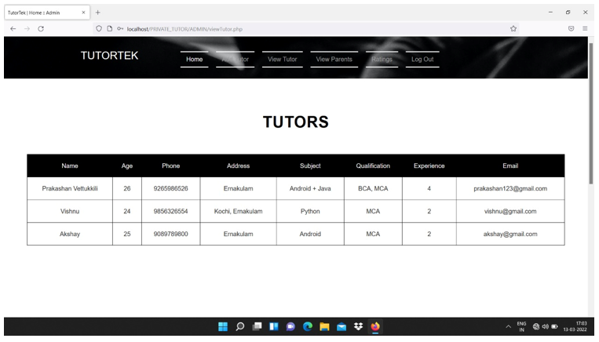
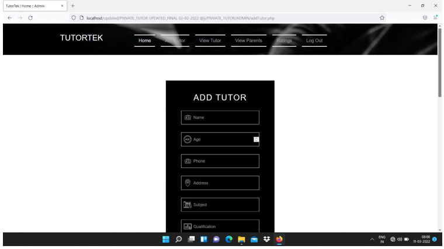

# Private Tutor Finder System

A web-based academic project that allows parents to find qualified private tutors based on subject, location, and availability. Tutors can manage bookings, respond to demo requests, and update their profiles. The system supports both online and offline tutoring options.

---
##  Abstract

The platform is designed to be a secure, user-friendly, and efficient tool for parents to find tutors for their children. It includes features such as tutor search, demo session requests, ratings, and profile management for tutors. The system was developed as part of a mini project for the Bachelor of Computer Applications program.

---
## Technology Stack

- **Frontend**: HTML, PHP
- **Scripting**: JavaScript
- **Backend**: PHP
- **Database**: MySQL
- **Database Interface**: phpMyAdmin
- **Platform**: WAMP

---

##  Modules

###  Admin
- Login using credentials
- Add/manage tutor information
- View registered parents

###  Parent
- Register/login
- View tutors (online/offline)
- Request demo lectures
- Book tutors
- View booked tutors
- Rate tutors

###  Tutor
- Login
- Set up and update profile
- View demo requests and bookings

---

##  System Features

- Secure login for all users
- Location-based tutor matching
- Demo lecture request and approval flow
- Booking and rating functionality
- Admin dashboard for managing users

---
##  Screenshots

---

##  Testing

The system was tested for:
- Unit functionality
- User flows (Parent/Tutor/Admin)
- Form validations
- Demo and booking interactions

---

##  Future Enhancements

- OTP-based login & authentication
- Payment gateway integration
- Mobile application support
- In-app messaging between parent and tutor

---

##  Authors

- **Ansly Roy** (Reg No: 190021093041)  
- **Gopika Gopakumar** (Reg No: 1900210930)  
- **Siji Varghese** (Reg No: 1900210930)  

Guided by: **Mr. Eldho Peter**  
Nirmala Arts and Science College, Mulanthuruthy, Kerala  
(Affiliated to Mahatma Gandhi University)

---

##  Academic Context

This project was developed in partial fulfillment of the requirements for the award of the degree of Bachelor of Computer Applications (BCA), 2021-22.

---

##  License

This project is shared for academic and learning purposes only.

